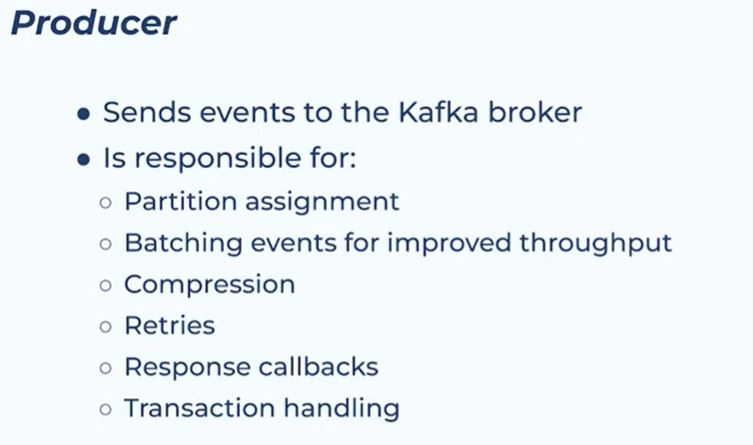
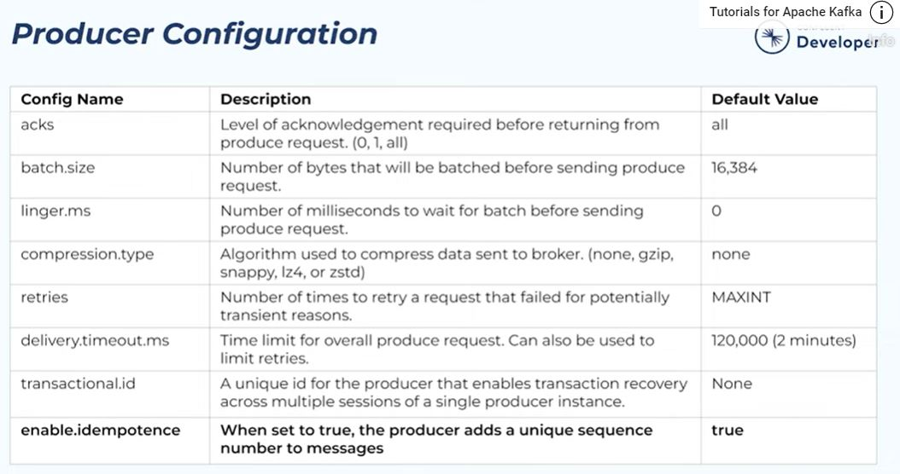
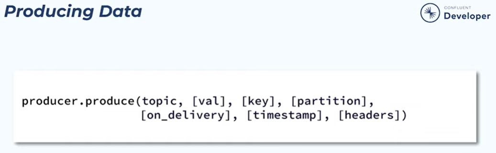
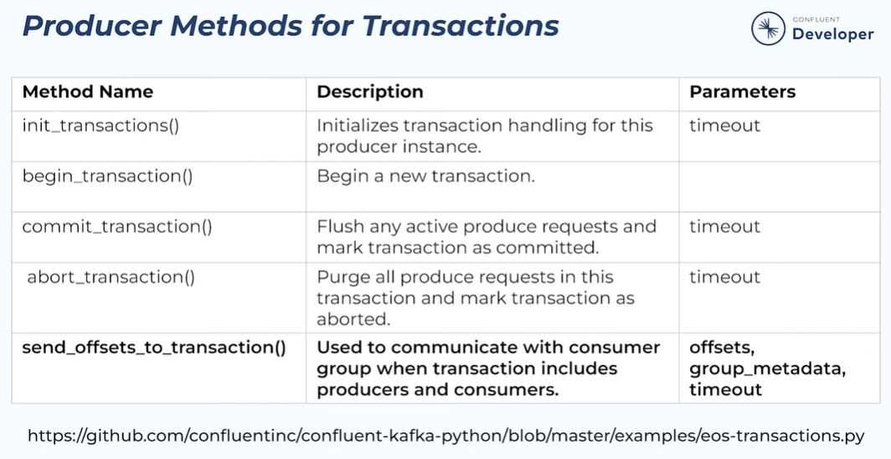
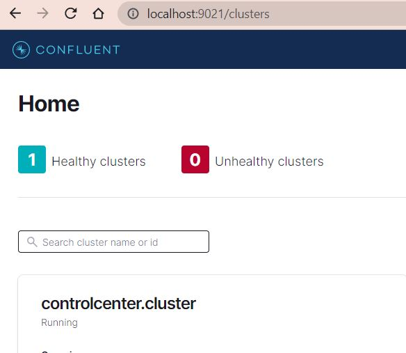

# confluent-kafka-python

This repository for keeping code from Introduction to [Python for Apache Kafka](https://developer.confluent.io/learn-kafka/kafka-python/intro)

# Table of contents

- [Setup Kafka](#setup-kafka)
- [Producer](#producer)
    - [Hands on](#hands-on--use-producer-to-send-events-to-kafka-)
- [Consumer](#consumer)
    - [Hands on](#hands-on--read-events-from-kafka)
- Schema-registry
- Serializers/ Deserilalizers
    - Protobuf
    - JSON Schema
    - Avro
- AdminClient

# Setup ( TODO )

## Kafka cluster
Create config file

## Client python

```bash
poetry install
```

# Producer
## producer responsibility



## producer configuration



## producing data



Example python

**Asynchronous-writes**

https://docs.confluent.io/kafka-clients/python/current/overview.html#asynchronous-writes

```python
for i in range(10):
    producer.produce(topic='my_topic', val=f'msg #{i}', key=str(i),
                    on_delivery=callback, header={'foo':'bar'})

producer.flush()
```

**Synchronous-writes**

https://docs.confluent.io/kafka-clients/python/current/overview.html#asynchronous-writes

```python
for i in range(10):
    producer.produce(topic='my_topic', val=f'msg #{i}', key=str(i),
                    on_delivery=callback, header={'foo':'bar'})
                    
producer.pull(10)
```

## producer method
https://github.com/confluentinc/confluent-kafka-python/blob/master/examples/eos-transactions.py



# Hands On ( Use Producer to Send Events to Kafka )

## Create Topics

1. Navigate to `controlcenter.cluster` at control-center ( http://localhost:9021/ )



2. Create a new topic called `hello_topic`, with `6` partitions and defaults settings.

## Project Setup

1. Start a virtual environment
```bash
poetry shell
```

## Create producer.py

1. Create `01-producer.py` at `src/01-producer.py`

2. Add Required Imports

```python
# producer.py

from confluent_kafka import Producer
from config import config
```

3. Create a function called callback() that can be passed to the produce() method.

```python
def callback(err, event):
    if err:
        print(f'Produce to topic {event.topic()} failed for event: {event.key()}')
    else:
        val = event.value().decode('utf8')
        print(f'{val} sent to partition {event.partition()}.')
```

4. Create a function called say_hello() that takes a producer and a key.
```python
def say_hello(producer, key):
    value = f'Hello {key}!'
    producer.produce('hello_topic', value, key, on_delivery=callback)
```

5. Add the following main block that will pull this all together
```python
if __name__ == '__main__':
    producer = Producer(config)
    keys = ['Amy', 'Brenda', 'Cindy', 'Derrick', 'Elaine', 'Fred']
    [say_hello(producer, key) for key in keys]
    producer.flush()
```

## Run the Program
```bash
python producer.py
```

Notice how the different names, which we are using for keys, result in specific partition assignments. To get a better idea of how this works, you can try changing some of the names and see how the partition assignment changes.

# Consumer

# Hands On ( Use Consumer to Read Events from Kafka )

## Create consumer.py

1. Create `02-consumer.py` at `src/02-consumer.py`

2. Add Required Imports

```python
from confluent_kafka import Consumer, KafkaException
from config import config
```

3. Create function to update configuration

```python
def set_consumer_configs():
    config['group.id'] = 'hello_group'
    config['auto.offset.reset'] = 'earliest'
    config['enable.auto.commit'] = False
```

4. Create a function called say_hello() that takes a consumer and a key.
```python

def assignment_callback(consumer, partitions):
    for p in partitions:
        print(f'Assigned to {p.topic}, partition {p.partition}')
```

5. Add the following beginnings of the main block.

```python
if __name__ == '__main__':
    set_consumer_configs()
    consumer = Consumer(config)
    consumer.subscribe(['hello_topic'], on_assign=assignment_callback)
    
    try:
        while True:
            event = consumer.poll(1.0)
            if event is None:
                continue
            if event.error():
                raise KafkaException(event.error())
            else:
                val = event.value().decode('utf8')
                partition = event.partition()
                print(f'Received: {val} from partition {partition}    ')
                # consumer.commit(event)
    except KeyboardInterrupt:
        print('Canceled by user.')
    finally:
        consumer.close()
```